# 🍕 Fast React Pizza Co.

A fast, minimal pizza ordering web app built with React, tailwind and redux toolkit. Browse the menu, build your cart, place an order with optional priority delivery, and track it in real time — all without creating an account.

---

## 🚀 Live Demo

[first-react-pizza](https://first-react-pizza.netlify.app/)

---

## 📐 Architecture Diagram

```mermaid
%%{init: {'theme': 'base', 'themeVariables': {
  'background': '#0b0f19',
  'primaryTextColor': '#ffffff',
  'primaryBorderColor': '#94a3b8',
  'lineColor': '#64748b',
  'clusterBkg': '#111827',
  'clusterBorder': '#475569',
  'titleColor': '#ffffff',
  'edgeLabelBackground': '#0b0f19'
}}}%%

flowchart TD

%% =========================
%% SRC
%% =========================
subgraph group_src["src"]
  main(("main.jsx"))
  app["App.jsx"]
  store[("store.js")]
  helpers["helpers.js"]
end

%% =========================
%% FEATURES
%% =========================
subgraph group_features["features"]

  subgraph menu_feature["menu"]
    menu["Menu.jsx"]
    menuitem["MenuItem.jsx"]
  end

  subgraph cart_feature["cart"]
    cart["Cart.jsx"]
    cartslice[("cartSlice.js")]
    cartitem["CartItem.jsx"]
    cartoverview["CartOverview.jsx"]
    updateqty["UpdateQty.jsx"]
    deleteitem["DeleteItem.jsx"]
    emptycart["EmptyCart.jsx"]
  end

  subgraph user_feature["user"]
    user["Username.jsx"]
    userslice[("userSlice.js")]
    createuser["CreateUser.jsx"]
  end

  subgraph order_feature["order"]
    order["Order.jsx"]
    createorder["CreateOrder.jsx"]
    orderitem["OrderItem.jsx"]
    searchorder["SearchOrder.jsx"]
    updateorder["UpdateOrder.jsx"]
  end

end

%% =========================
%% SERVICES
%% =========================
subgraph group_services["services"]
  api_rest["apiRestaurant.js"]
  api_geo["apiGeocoding.js"]
end

%% =========================
%% UI
%% =========================
subgraph group_ui["ui"]
  layout["AppLayout.jsx"]
  header["Header.jsx"]
  home["Home.jsx"]
  button["Button.jsx"]
  linkbtn["LinkButton.jsx"]
end

%% =========================
%% RELATIONS
%% =========================
main -->|"bootstraps"| app
app -->|"uses"| store
app -->|"renders"| layout

layout --> header
layout --> home

header --> button
header --> linkbtn

menu --> menuitem
menu --> api_rest
menu -.-> helpers

cart --> cartslice
cart --> cartitem
cart --> cartoverview
cart --> updateqty
cart --> deleteitem
cart --> emptycart

user --> userslice
user --> createuser

order --> createorder
order --> orderitem
order --> searchorder
order --> updateorder

createorder --> cartslice
createorder --> userslice
createorder --> api_rest
createorder -.-> api_geo

searchorder --> api_rest
updateorder --> api_rest

store --> cartslice
store --> userslice

%% =========================
%% STYLES
%% =========================
classDef srcStyle fill:#0f172a,stroke:#3b82f6,color:#ffffff,stroke-width:2px
classDef featureStyle fill:#1e1b4b,stroke:#8b5cf6,color:#ffffff,stroke-width:2px
classDef serviceStyle fill:#052e16,stroke:#22c55e,color:#ffffff,stroke-width:2px
classDef uiStyle fill:#3f1d02,stroke:#f59e0b,color:#ffffff,stroke-width:2px
classDef stateStyle fill:#3b0764,stroke:#c084fc,color:#ffffff,stroke-width:3px

class main,app,helpers srcStyle
class menu,menuitem,cart,cartitem,cartoverview,updateqty,deleteitem,emptycart,user,createuser,order,createorder,orderitem,searchorder,updateorder featureStyle
class api_rest,api_geo serviceStyle
class layout,header,home,button,linkbtn uiStyle
class store,cartslice,userslice stateStyle
```


---

## ✨ Features

- Browse a live pizza menu fetched from an external API
- Add/remove pizzas and manage quantity from the cart
- Order without signing up — just enter your name
- Auto-fetch your GPS location for delivery address
- Optional **priority delivery** (20% surcharge) — set at order time or after
- Real-time order status and estimated delivery time
- Update order priority even after placing it

---

## 🛠️ Tech Stack


---

## 📁 Project Structure

```
src/
├── features/
│   ├── cart/         # Cart slice, components
│   ├── menu/         # Menu fetching & display
│   ├── order/        # Create, view & update orders
│   └── user/         # Username, geolocation, address
├── services/         # API calls (restaurant, geocoding)
├── ui/               # Shared UI components (Button, etc.)
├── utils/            # Helper functions
├── App.jsx           # Route definitions
└── store.js          # Redux store
```

---

## ⚙️ Getting Started

```bash
# Clone the repo
git clone https://github.com/AbiDev2003/fast-react-pizza.git
cd fast-react-pizza

# Install dependencies
npm install

# Start dev server
npm run dev
```

---

## 🧠 Key Concepts Practiced

- React Router **loaders** and **actions** for data fetching and form handling
- **Redux Toolkit** with `createSlice` and `createAsyncThunk`
- `useFetcher` for background mutations without navigation
- Geolocation API + reverse geocoding for auto address fill
- Tailwind CSS utility-first responsive design

---

## 👨‍💻 Author

**Abinash Dash** — [github.com/AbiDev2003](https://github.com/AbiDev2003)

---

> Built while learning from Jonas Schmedtmann's React course on Udemy.